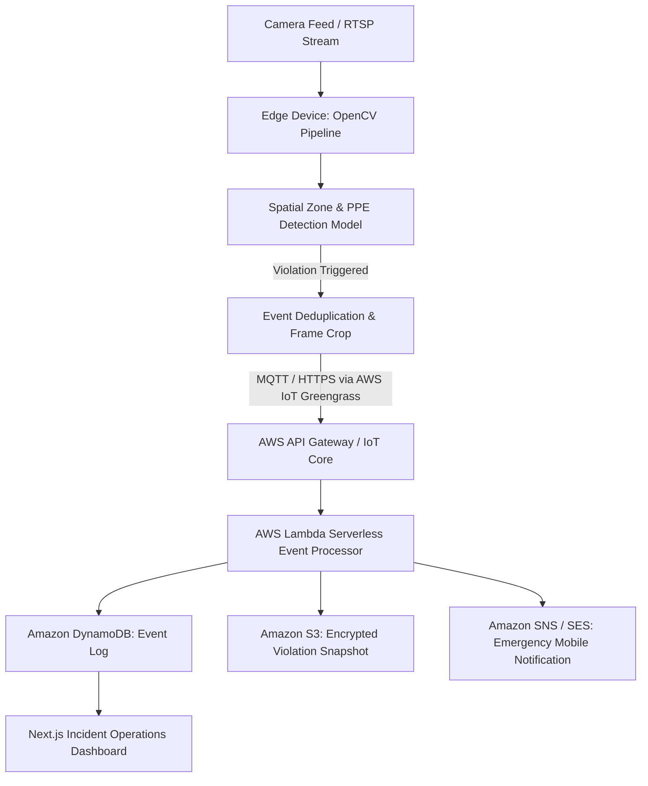

# Technical Specification: EdgeSentry
**Project Name:** EdgeSentry (OpenCV AI Competition powered by AWS)  
**Status:** Rebuilt in Python + OpenCV (updated 2026-09-18)  

> **Implementation status (2026-09-18):** Rebuilt from the Node prototype (now under `legacy-js/`) into a Python + OpenCV package (`edgesentry/`). Real OpenCV throughout: `cv2.pointPolygonTest` zone intrusion, HSV hi-vis PPE detection, a `cv2.dnn` ONNX detector (HOG where available), `cv2.VideoCapture` streaming with `cv2.polylines`/`putText` annotation, a persistence temporal filter, and boto3 SNS/S3 dispatch with a simulator fallback. 8 pytest cases pass on synthetic frames (no camera/model needed). Not yet run in production: a real RTSP/camera feed, a trained ONNX PPE model, edge hardware/IoT certs, and deployed AWS infra (SAM/CDK, Lambda, DynamoDB).
**Version:** 1.0.0  

---

## 1. System Topology
EdgeSentry splits processing between localized edge nodes (real-time OpenCV frame analysis, object tracking, and optical flow) and an AWS serverless cloud backend for event auditing, push notifications, and model retraining triggers.



---

## 2. OpenCV Vision Pipeline Specification

### 2.1 Pre-processing & Region of Interest (ROI)
- Dynamic perspective transform to project 2D camera coordinates into ground-plane metric coordinates.
- User-defined polygonal restricted zones using `cv2.pointPolygonTest`.

### 2.2 Inference & Object Tracking
- Run quantized INT8 YOLOv8/YOLOv11 model through OpenCV DNN module (`cv2.dnn.readNetFromONNX`).
- Multi-target tracking using ByteTrack / OpenCV SORT algorithm to maintain object IDs across camera occlusions.

### 2.3 Edge Alert Filtering
- Temporal filtering: Alert triggers only if an unauthorized person remains in a danger zone for `> 1.5s` to avoid false-positive transient detections.

---

## 3. Serverless Backend Schema

### 3.1 Violation Event Schema (DynamoDB)
```json
{
  "eventId": "evt_20261027_00412",
  "timestamp": 1793081234,
  "cameraId": "cam_floor_b_zone3",
  "violationType": "ZONE_INTRUSION_NO_HARDHAT",
  "confidenceScore": 0.942,
  "snapshotS3Uri": "s3://edgesentry-vault-2026/snapshots/evt_00412.jpg",
  "zoneCoordinates": [[120, 340], [450, 340], [400, 600], [100, 580]],
  "resolved": false
}
```

---

## 4. Acceptance Criteria
1. OpenCV edge pipeline operates at `> 20 FPS` on simulated or local hardware.
2. Accurate detection of both person and safety equipment violation in polygon test zone.
3. Successful edge-to-cloud dispatch to AWS IoT Core / Lambda with snapshot uploaded to S3.
4. Real-time alert rendering on the Web Operations console within 2 seconds of physical event.
